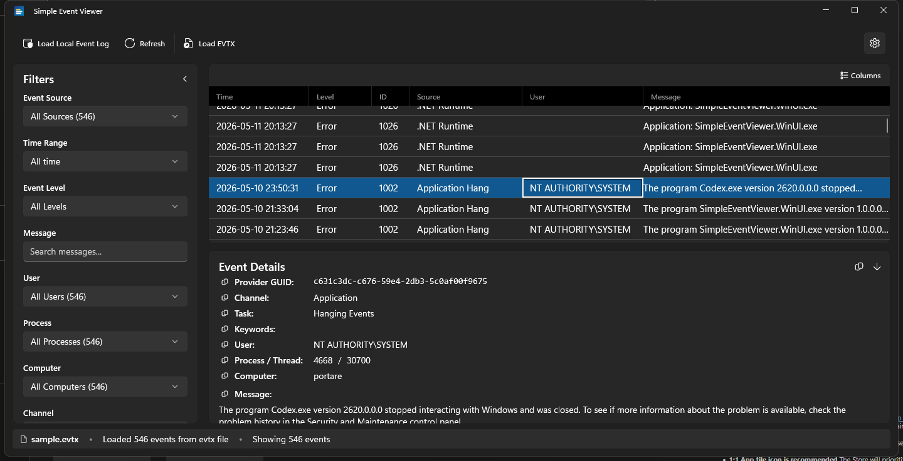

# Simple Event Viewer

A modern Windows Event Log viewer built with **WinUI 3** and the Windows App SDK. Reads live system event logs and saved `.evtx` files (with experimental support for `.xml` and `.etl`), and exposes rich filtering, sorting, copy/export, and an optional local MCP server.



> Current release: **v1.2.0** — see [CHANGELOG.md](CHANGELOG.md).

## Features

### Data sources
- **Live system logs** (Application channel) via `EventLogReader`
- **EVTX files** (`.evtx`) — native read via `EventLogReader` with `PathType.FilePath`
- **XML files** (`.xml`) *(experimental, off by default)* — parsed events from saved event XML; only `wevtutil qe ... /f:xml` output is reliably supported
- **ETL files** (`.etl`) *(experimental, off by default)* — read via `EventLogReader`; kernel/provider traces may render with limited detail

The XML and ETL loaders are hidden by default and only appear in the **Open** menu once you flip **Settings → Experimental features → Load XML / ETL files**.

The current source is shown in the status bar *and* in the window title bar — e.g. *"sample.evtx — Simple Event Viewer"* or *"Live system logs — Simple Event Viewer"*. The title format is configurable in **Settings → Title Bar Format** (three layouts). The **Refresh** toolbar button is contextual: it reads "Refresh live logs" or "Reload sample.evtx" depending on what's loaded, and re-reads that same source (it doesn't silently swap back to live when a file is open).

### Time range
Unified time selector in the filter panel with presets — "Last hour", "Last 24 hours", "Last 7 days", "Last 30 days", "All time", "Custom range...". Defaults to **Last 24 hours** so startup is fast.

- For **live logs**: the preset narrows the EventLogQuery (XPath `timediff` filter), so we only read events from disk that the user wants.
- For **file sources**: the preset is computed relative to the *newest event in the file* and applied as a display filter (no re-read).
- **Custom range** exposes date+time pickers for start and end. Live data reloads with the exact range; file data filters in-memory.

### Smart loading
- **Streaming** — events flow into the UI as they're read from the log. A `ConcurrentQueue` collects them off the UI thread; a `DispatcherQueueTimer` drains up to 500 per tick (every 200 ms). The UI stays responsive even when 50k+ events are loading.
- **Total count** is queried on a parallel background task so progress displays `Loading system logs... (N/M events)` instead of `(N/?)`.
- **Background prefetch** — after the initial load completes, an idle prefetch (delayed 5 s) reads *older* events into memory so widening the time range later is instant. Cancels on refresh or file load.
- **Smart range switching** — widening (24h → 7d) reloads only if older events aren't already cached; narrowing (7d → 24h) just refilters the existing data.

### Filters
Filter panel (left side, resizable + collapsible):

1. **Event Source** (provider name) — multi-select by default
2. **Time Range** (presets + custom)
3. **Event Level** (Critical / Error / Warning / Information / Verbose) — multi-select by default
4. **Message** (search substring in event message)
5. **User**
6. **Process** (PID, sorted numerically)
7. **Computer**
8. **Channel** (log channel like `Application`, `Security`, etc.)

Each dimension can be flipped between single-select (ComboBox) and multi-select (DropDownButton + checkbox flyout) independently under **Settings → Filter multi-select**. Defaults are *Source* and *Level* multi, the rest single — matching typical event-log workflows.

**Cross-aware options.** When a filter is set, every *other* dropdown narrows to values that actually appear in the matching events, with live counts. So selecting `Time Range = Last 24 hours` prunes the Source / User / Process / Computer / Channel lists to whatever shows up in that window.

**Active-filter indicator.** A thin accent bar appears next to a filter's label whenever it has a non-default selection, so it's clear at a glance which filters are reducing the view. "Clear All Filters" resets every dimension.

**Save / Load.** The two buttons under the filter list write the entire current selection — every dimension, the time range, and the message search — to a portable JSON file you can pick back up later.

### Events grid
- Multi-select (Ctrl/Shift+click) with Ctrl+A to select all
- Sortable columns — click a header to sort, click again to reverse
- Resizable, reorderable columns. **Widths and visibility persist** across launches (toggleable in Settings)
- **Columns** button opens a checklist to show/hide columns; the same configuration is mirrored under **Settings → Default columns shown**
- **Export** button next to Columns writes the current view to CSV / JSON / XML, then offers to open the containing folder in Explorer
- Level column shows a colored badge (Critical / Error / Warning / Information / Verbose); whole-row tint is the default and can be flipped to badge-only in Settings
- Message row height is capped (1, 2, 3, 4, 5, or 10 lines), but each row only takes the height it actually needs

### Event details
Bottom panel (resizable + collapsible) with full event info: ID, Level, Time, Provider, Provider GUID, Channel, Task, Keywords, User, Process/Thread, Computer, Message, and a collapsible XML view.

- Each field has a copy button next to its label
- All text is selectable
- A "copy all" button in the header copies the full detail block

### Copy/export
Right-click on a row (or selection) for:
- **Copy row** — tab-separated, ideal for pasting into spreadsheets (Ctrl+C also works)
- **Copy cell** — the specific cell you right-clicked
- **Copy message only**
- **Copy as… → CSV** (with header + escaping)
- **Copy as… → JSON** (pretty-printed)
- **Copy as… → XML** (`<Events><Event Time="…" Level="…" Id="…"><Source>…</Source>…`)

For bulk exports the toolbar's **Export** button writes every event in the current filtered view, not just the selection. Same three formats; same payload shape (the in-clipboard and on-disk representations are produced from the same `Services/EventExporter`).

### Settings
Available via the gear icon in the toolbar. Navigating to Settings and back preserves the loaded events and the active filter selection (`NavigationCacheMode="Required"` on MainPage).

- **Theme** — System default / Light / Dark, plus bundled presets **High Contrast**, **Nord (dark)**, **Dracula (dark)**, **Solarized (dark)**, **Sepia (light)**. Curated presets carry their own accent palette *and* override the page/card/text surface colors so they're visually distinct, not just an accent swap.
- **Color scheme** — Default, Blue, Green, Purple, Orange, Red. Drives the level badges *and* app-wide accent colors (buttons, focus rings, DataGrid selection highlight). Ignored while a curated preset is active.
- **Row color style** — Badge only / Entire row (default)
- **Title Bar Format** — `source — Simple Event Viewer` (default) / `Simple Event Viewer` / `Simple Event Viewer — source`
- **Message lines** — 1, 2, 3, 4, 5, or 10 line cap per row
- **Remember column widths** — DataGrid column widths are restored on next launch (on by default)
- **Default columns shown** — checkbox per column; mirrors the toolbar Columns menu
- **Filter multi-select** — one toggle per filter dimension; controls whether the dropdown is single-select (ComboBox) or multi-select (DropDownButton + checkboxes)
- **Experimental features → Load XML / ETL files** — adds the XML / ETL entries to the **Open** menu (off by default)
- **MCP server** — toggle a local Model Context Protocol server (see below); port is configurable, default 7321. Settings page exposes copyable client configs for VS Code, Cursor, Claude Desktop, and Claude Code.
- **Restore defaults** — resets every preference on the page to its first-launch value (with confirmation dialog)
- **About** — shows the running version read from `Package.Current.Id.Version`

All settings persist to `ApplicationData.Current.LocalSettings`.

### MCP server (Model Context Protocol)
Optional in-process server that exposes the currently-loaded events to an LLM client over local HTTP+JSON-RPC. Enable it from **Settings → MCP Server**.

- Bound to `127.0.0.1` only — not reachable from the network
- Default port: `7321`
- Single endpoint: `POST http://127.0.0.1:<port>/` accepts JSON-RPC 2.0 messages
- Supported methods: `initialize`, `tools/list`, `tools/call`, `ping`

Available tools:

| Tool | Description |
|---|---|
| `current_source` | Returns the label of whatever is currently loaded (e.g. `Live system logs` or a filename) and the total event count |
| `event_summary` | Returns total + counts broken down by level (Critical / Error / Warning / Information / Verbose) |
| `list_events` | Newest-first slice of events with `limit`, `offset`, optional `level` / `source` filters |
| `search_events` | Case-insensitive substring search across event messages |
| `get_event` | Full details of a specific event by its newest-first index |

Quick sanity check from a shell:

```pwsh
curl http://127.0.0.1:7321/
# {"server":"SimpleEventViewer","version":"1.2.0",...}

curl -X POST http://127.0.0.1:7321/ -H "Content-Type: application/json" `
     -d '{"jsonrpc":"2.0","id":1,"method":"tools/list"}'
```

## Architecture

```
SimpleEventViewer/
├── Models/
│   ├── EventLevel.cs              # LogLevel enum (Critical, Error, ...)
│   └── EventLogEntry.cs           # Event model + SourceCategory
├── Services/
│   ├── EventLogService.cs         # Singleton; reads logs, streams batches via events
│   ├── EventLogFileReader.cs      # Pure file-read logic (testable, no WindowsAppSDK dep)
│   ├── EventFilter.cs             # Pure filter logic; HashSet<> overload for multi-select
│   ├── EventExporter.cs           # CSV / JSON / XML serialization (Copy as… + Export button)
│   ├── FilterPersistence.cs       # Save/load filter presets as JSON
│   ├── SettingsService.cs         # Singleton; persisted UI preferences
│   ├── AccentTheme.cs             # App-wide accent + surface-brush mutation
│   ├── ThemePresets.cs            # Nord / Dracula / Solarized / Sepia / High Contrast palettes
│   └── Mcp/
│       └── EventLogMcpServer.cs   # Local MCP server (HTTP + JSON-RPC)
├── ViewModels/
│   └── MainViewModel.cs           # ObservableObject; bindings + filter logic
├── Converters.cs                  # Level→Brush, DateTimeOffset, etc.
├── Win32FilePicker.cs             # P/Invoke GetOpenFileName (more reliable than FileOpenPicker)
├── MainPage.xaml                  # Main UI
├── SettingsPage.xaml              # Settings page (Frame navigation from MainPage)
├── Package.appxmanifest           # MSIX identity (Store-registered)
└── installer.wxs                  # WiX 5 installer definition
```

### Threading model
- `EventLogService.LoadCurrentSystemLogs` runs on a background thread (`Task.Run`)
- It emits `OnEventBatchLoaded` events with batches of 100 entries
- The ViewModel enqueues batches into a `ConcurrentQueue<EventLogEntry>`
- A `DispatcherQueueTimer` ticks every 200 ms on the UI thread, draining up to 500 entries per tick into the `ObservableCollection`
- Filter changes never reload from disk if the requested range is a subset of what's already in memory

### Why these choices

| Decision | Why |
|---|---|
| **Single-project WinUI 3** (no separate packaging project) | Simpler structure; modern WinAppSDK supports MSIX directly via `EnableMsixTooling`. |
| **CommunityToolkit DataGrid** instead of ListView | Built-in resize/sort/reorder of columns. Pays a render cost vs ListView, mitigated by batched updates. |
| **Throttled UI flush** (timer + queue) | Without it, fast streaming triggers thousands of `CollectionChanged` events that overwhelm the DataGrid. Batching at 200 ms keeps the UI at 60 fps during load. |
| **No sorted insertion during streaming** | `EventLogReader` with `ReverseDirection=true` returns events already in time order. Appending is O(1); binary-search insertion was O(n) per event due to shifting. |
| **XPath query for time presets** | Pushes the time filter into Windows itself instead of reading the entire log and discarding. "Last 24 hours" on a busy machine goes from 30s to <2s. |
| **Background prefetch** | Best of both worlds: fast initial load *and* instant switching to wider ranges later. Cancels cleanly on any user action. |
| **Per-cell copy + per-field copy buttons** | Three-tier copy UX: cell (right-click → Copy cell), row (right-click → Copy / Ctrl+C), and field (button next to label). Detail fields are also `IsTextSelectionEnabled` for partial copies. |
| **Static converter instances** | The DataGrid's `LoadingRow` fires for every row scroll. Reusing a single `LevelToRowBrushConverter` and `SolidColorBrush` instance avoids per-row allocations. |

## Build & run

Requires .NET 10 SDK and Windows 10.0.17763+ for runtime.

```pwsh
dotnet restore
dotnet run
```

For a self-contained published build:

```pwsh
dotnet publish -c Release -p:Platform=x64 -r win-x64 --self-contained true -o publish
```

## CI / installers

`.github/workflows/build.yml` builds on every push to `main`, every PR, and every `v*` tag:

- **MSIX** — `msbuild ... /p:GenerateAppxPackageOnBuild=true /p:AppxPackageSigningEnabled=false`. Unsigned; sign with your own cert for distribution.
- **MSI** — produced from `installer.wxs` (WiX 5) wrapping a self-contained publish. Installs to `Program Files\Simple Event Viewer` with a Start Menu shortcut and uninstall support.

Both are uploaded as workflow artifacts. Pushing a `v*` tag also creates a GitHub Release with both installers attached.

Trimming and ReadyToRun are explicitly disabled during the MSIX build (`PublishTrimmed=false`, `PublishReadyToRun=false`) because they require self-contained publishing. The MSIX uses framework-dependent deployment via the Windows App SDK runtime.

## How this was built

Almost entirely vibe-coded with [Claude Code](https://www.anthropic.com/claude-code). Cumulative session stats at the time of v1.1.0:

```
┌───────────────────┬───────┬───────────┬─────────────┬───────────────┬───────────────────┬───────────────┐
│      Project      │ Reqs  │   Local   │   Remote    │ Prompt tokens │ Completion tokens │ Upstream time │
├───────────────────┼───────┼───────────┼─────────────┼───────────────┼───────────────────┼───────────────┤
│ SimpleEventViewer │ 1,501 │ 200 (13%) │ 1,301 (87%) │         691 M │             962 K │       28.9 hr │
└───────────────────┴───────┴───────────┴─────────────┴───────────────┴───────────────────┴───────────────┘
```

## License & credits

Created by Gus Catalano — [github.com/guscatalano](https://github.com/guscatalano).
